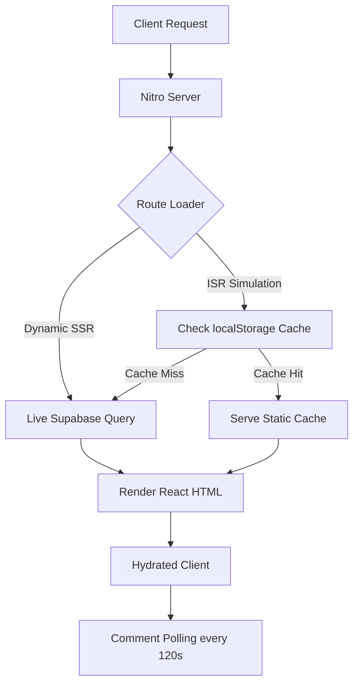

# Indie Coffee Hub — Technical Documentation

A comprehensive reference for the **Indie Coffee Hub** codebase — a global directory of independent specialty cafes built for remote workers and coffee enthusiasts.

---

## 1. Project Overview

**Indie Coffee Hub** is a curated directory helping users discover independent specialty coffee shops suited for remote work. Key capabilities:

- **Specialty Cafe Catalog:** Searchable directory filtered by country, city, and neighborhood.
- **Nomad Amenity Metrics:** WiFi, plug points, noise levels, AC, and pet-friendliness per cafe.
- **Admin Command Center:** Role-restricted dashboard for full CRUD on cafes, cities, and countries with image upload pipelines.
- **Hybrid Rendering Simulator:** Demonstrates SSR vs. ISR with simulated edge CDN webhook invalidation.
- **Community Reviews:** Comment threads with background polling for real-time note syncing.
- **The Brew Compass:** Educational micro-app with drink guides, recipe calculators, roast spectrum, and origin mapping.

---

## 2. Technology Stack

| Layer | Technology | Version | Purpose |
| :--- | :--- | :--- | :--- |
| **Core Framework** | React | `^19.2.0` | UI rendering, hooks, and state management |
| **Meta-Framework** | TanStack React Start | `^1.167.50` | SSR, hydration, and server middleware |
| **Routing** | TanStack React Router | `^1.168.25` | Type-safe file-based routing with loader preloading |
| **Data Fetching** | TanStack React Query | `^5.83.0` | Async state, caching, and mutation tracking |
| **Database & Auth** | Supabase JS SDK | `^2.108.2` | PostgreSQL, auth sessions, and profiles |
| **Styling** | Tailwind CSS | `^4.2.1` | Utility-first CSS with native build-time compiler |
| **Image Hosting** | Cloudinary API | — | Storage, WebP transcoding, and dynamic compression |
| **Bundler & Server** | Vite & Nitro | `^8.0.16` / `^3.x` | Build tool and SSR/API server engine |
| **UI Components** | Radix UI / Lucide React | Various | Accessible primitives and iconography |
| **Validation** | Zod / React Hook Form | `^3.24.2` / `^7.71.2` | Search param schemas and admin form validation |

---

## 3. Folder Structure

```text
indie_cafe_hub/
├── .env                                  # Environment variables
├── package.json                          # Dependencies and scripts
├── vite.config.ts                        # Vite + TanStack Start + Nitro config
├── netlify.toml                          # Netlify build config
├── documentation/
│   └── technical_documentation.md       # This file
├── database/
│   ├── 1_table_creation.sql             # Core table schemas
│   ├── 2_index_optimization.sql         # SQL index optimizations
│   ├── 3_triggers_and_functions.sql     # Profile auto-creation trigger
│   ├── 4_RLS_and_policies.sql           # Row Level Security policies
│   ├── 5_seed_initial_data.sql          # Seed data for cities/countries/cafes
│   └── database_schema.md               # DB schema reference
└── src/
    ├── components/
    │   ├── ui/                           # Radix-based primitives (button, dialog, carousel, etc.)
    │   ├── accessibility-context.tsx     # Color-blindness theme context provider
    │   ├── cafe-card.tsx                 # Reusable cafe card (alternating horizontal layout, tag badges)
    │   ├── comments-section.tsx          # Comment thread with background polling
    │   ├── diptych-card.tsx              # Editorial layout card with full-bleed image and metadata lists
    │   ├── index-card.tsx                # Classic index-style cafe card variant
    │   ├── label-card.tsx                # Tag/label layout cafe card variant
    │   ├── magazine-card.tsx             # Magazine style layout used on the homepage
    │   └── site-chrome.tsx              # Global Header, Footer, and Profile Modal
    ├── hooks/
    │   └── use-mobile.tsx               # Responsive breakpoint listener
    ├── lib/
    │   ├── auth-context.tsx             # Supabase Auth session wrapper and profile sync
    │   ├── cache.ts                     # ISR simulation cache utility (localStorage)
    │   ├── cafes.ts                     # DB queries, Cafe type, and UI mapping logic
    │   ├── error-capture.ts             # Global SSR exception listener
    │   ├── error-page.ts               # Fallback HTML for catastrophic errors
    │   ├── supabase.ts                  # Supabase client instantiation
    │   └── utils.ts                     # Tailwind merge utilities
    └── routes/
        ├── __root.tsx                   # Global layout, context providers
        ├── index.tsx                    # Homepage — featured cafes grid + hero search
        ├── directory.tsx               # Search and filter catalog
        ├── admin.tsx                   # Protected admin dashboard
        ├── login.tsx                   # Sign-in form
        ├── signup.tsx                  # Sign-up form
        ├── forgot-password.tsx         # Password reset request
        ├── reset-password.tsx          # Password reset confirmation
        ├── about.tsx                   # Static info page
        ├── contact.tsx                 # Static contact page
        ├── brew-compass/               # Educational micro-app (nested routes)
        ├── $country.$city.tsx          # City-filtered cafe list
        └── $country.$city.$cafeSlug.tsx  # Individual cafe detail page
```

---

## 4. Architecture and Data Flow

TanStack Start + Nitro handle SSR on the server; React manages hydration on the client.



**Rendering Modes:**
- **Dynamic SSR:** `fetchCafes()` bypasses cache — always queries Supabase live. Admin changes are instantly visible.
- **ISR Simulation:** Reads from `indie_cafe_static_cache` in localStorage. Admin saves trigger a simulated webhook that clears and refills the cache, mimicking edge CDN invalidation.

---

## 5. Pages and Routes

### Homepage (`/`) — `src/routes/index.tsx`
- Loader calls `fetchFeaturedCafes()` to retrieve handpicked featured cafes.
- **Featured layout:** Renders cards using `MagazineCard` in a vertical list layout with alternating self-start and self-end alignments (width `w-full lg:w-[65%]`).
- Sections: Featured Cafes → Hero Search → Brew Compass CTA → Monospace ticker marquee.

### Directory (`/directory`) — `src/routes/directory.tsx`
- Loader fetches `cafes` and `cities` in parallel via `Promise.all`.
- Client-side filters: text search (`filter-search-input`), country select (`filter-country-select`), city select (`filter-city-select`), WiFi-only toggle (`filter-wifi-toggle`).
- Rendering strategy badge shows "Static CDN Edge (ISR)" or "Live DB Query (Dynamic SSR)".

### Cafe Detail (`/$country/$city/$cafeSlug`) — `src/routes/$country.$city.$cafeSlug.tsx`
- Validates URL params against DB data; renders a custom 404 on mismatch.
- Features: zoomable hero image lightbox, noise-level emoji gauge, per-day opening hours, plug point status, community reviews board.

### Admin (`/admin`) — `src/routes/admin.tsx`
- Role-gated: renders locked state card for non-admins (`data-testid="admin-locked-state"`).
- **Cafe CRUD:** Create, edit, delete cafes with image upload pipeline (Cloudinary → Supabase).
- **`created_by` capture:** On **create**, `supabase.auth.getUser()` is called at insert time and the admin's UUID is written to `cafes.created_by`. Not overwritten on update.
- **Pending Approvals Pipeline (latest changes):** A dedicated moderation queue section displays all cafes with `status === 'pending'`. Admins can review details and click "Approve" to update the cafe's status in the database to `'approved'`.
- **Country & City Registries:** Separate forms for managing geographical data.
- **Pipeline Tracker:** Visualizes write stages — Serialize → Media CDN → Supabase Write → Webhook.

### Sign Up (`/signup`) — `src/routes/signup.tsx`
- On successful `supabase.auth.signUp()`, displays **"Sign Up Successful!"** with "Your account has been created. You can now sign in."
- No email verification copy shown. A **"Go to Login"** button links to `/login`.
- **Redirection (latest changes):** Supports the `returnTo` search query parameter to persist the user flow after signup and login.

### Sign In (`/login`) — `src/routes/login.tsx`
- Authenticates via `supabase.auth.signInWithPassword()`. Admins redirect to `/admin`; standard users to `/`.
- **Redirection (latest changes):** Supports the `returnTo` search query parameter to redirect the user back to their original page (e.g., redirecting to `/admin` after attempting to "Submit a Cafe" as a guest).

### Brew Compass (`/brew-compass`) — `src/routes/brew-compass/`
Sub-modules: `menu-decoder`, `chilled-bar`, `black-coffee`, `global-specialties`, `connoisseur`, `bean-roast-spectrum`, `coffee-atlas`, `milk-types`.

---

## 6. `CafeCard` Component — `src/components/cafe-card.tsx`

The primary display unit across the homepage, directory, and city pages.

| Feature | Implementation |
| :--- | :--- |
| **Image** | Fixed `h-64 md:h-full w-full md:w-1/2 object-cover object-center` — alternating left/right side based on even/odd index |
| **Card wrapper** | `flex flex-col md:flex-row w-full h-auto md:h-80 border-2 border-[#1A1715] rounded-none overflow-hidden` — dynamic layout direction |
| **Body** | `flex flex-col justify-between p-6 flex-grow` — with dynamic background gradients based on the index |
| **Description / Blurb** | `line-clamp-3` — truncates with `…` to cap text height variance |
| **Location row** | `MapPin` (neighborhood) + `Clock` (hours) + `Globe` (city, country) — Globe row only renders if `city_name` or `country_name` is present |
| **Props** | `cafe: Cafe`, `className?: string`, `to?: string`, `index: number` — `index` is required to alternate layout and gradients |

---

## 7. `Cafe` Type and Data Layer — `src/lib/cafes.ts`

### `Cafe` Type (key fields)
```ts
type Cafe = {
  id: string;              // slug or UUID
  dbId: string;            // raw DB UUID
  name: string;
  neighborhood: string;
  blurb: string;           // mapped from DB `description`
  image: string;           // Cloudinary-optimized hero URL
  gallery: string[];
  tags: string[];          // derived from amenity booleans + specialty_focus
  wifi: boolean;
  hours: string;           // derived from opening_hours.monday or "9am – 9pm" fallback
  city_name?: string;      // resolved from cities join
  country_name?: string;   // resolved from cities.countries join
  created_by_name?: string;// resolved from profiles join (detail page only)
  city_id?: string;
  noise_level?: "quiet" | "moderate" | "bustling";
  opening_hours?: { monday?: string; ... sunday?: string };
  google_maps_url?: string;
  status?: "pending" | "approved" | "rejected"; // (latest changes) Approval state
  created_by?: string;                          // (latest changes) Author user UUID
};
```

### Key Functions
| Function | Supabase Query | Notes |
| :--- | :--- | :--- |
| `fetchCafes()` | `select("*, cities(name, countries(name))")` | Joins city + country names; serves ISR localStorage cache. (latest changes) Filtered to status = 'approved'. |
| `fetchCafesByCity(cityId)` | `select("*").eq("city_id", cityId)` | City detail pages. (latest changes) Filtered to status = 'approved'. |
| `fetchFeaturedCafes()` | `select("*, cities(name, countries(name))")` | (latest changes) Returns up to 6 featured cafes filtered to status = 'approved'. |
| `fetchCafeByIdOrSlug(id)` | `select("*")` + separate profiles query | Resolves `created_by_name`; always bypasses ISR cache |
| `fetchCities()` | `select("*, countries(*)")` | Falls back to hardcoded list on DB error |
| `fetchCountries()` | `select("*")` | Ordered by name |
| `optimizeCloudinaryUrl()` | — | Appends `f_auto,q_auto,w_N` to Cloudinary URLs |

---

## 8. Authentication — `src/lib/auth-context.tsx`

| Action | Implementation |
| :--- | :--- |
| **Sign Up** | `supabase.auth.signUp()` with `full_name` in metadata. UI shows success screen — no verification email message. |
| **Sign In** | `supabase.auth.signInWithPassword()`. `isAdmin` flag read from `profiles.is_admin`. |
| **Sign Out** | `supabase.auth.signOut()` + context flush |
| **Session init** | `getSession()` on mount + `onAuthStateChange()` listener |
| **Profile update** | Updates `auth.updateUser` metadata and `profiles.full_name` in DB |

`AuthUser` context shape: `{ email, name, isAdmin }`. Raw UUID is **not** stored in context — features requiring it call `supabase.auth.getUser()` directly (e.g., `created_by` on cafe insert in `admin.tsx`).

---

## 9. Database Schema — Supabase / PostgreSQL

### `profiles`
`id` (uuid, PK → auth.users) | `full_name` | `avatar_url` | `is_admin` (bool, default false) | `created_at` / `updated_at`

### `countries`
`id` (uuid, PK) | `name` (unique) | `code` (ISO, unique) | `created_at`

### `cities`
`id` (uuid, PK) | `name` | `slug` (unique) | `country_id` (FK → countries, cascade delete) | `created_at`  
Unique compound: `(country_id, name)`

### `cafes`
`id` (uuid, PK) | `name` | `slug` (unique) | `description` | `neighborhood` | `address` | `google_maps_url` | `has_wifi` | `has_plug_points` | `has_ac` | `is_pet_friendly` | `hero_image_url` | `gallery_image_urls` (text[]) | `opening_hours` (jsonb) | `specialty_focus` | `noise_level` (check: quiet/moderate/bustling) | `city_id` (FK → cities, set null) | `created_by` (FK → auth.users, set null) | `status` (approval_status: pending/approved/rejected, default pending) (latest changes) | `is_featured` (boolean, default false) (latest changes) | `created_at` / `updated_at`

> `created_by` is written on **insert only** using the admin's live UUID from `supabase.auth.getUser()`. It is not modified on subsequent updates.

### `comments` (latest changes)
`id` (uuid, PK) | `cafe_id` (FK → cafes, cascade delete) | `user_id` (FK → auth.users, set null) | `guest_name` (varchar 100, nullable) | `content` | `created_at`

> **Note (latest changes):** Comments support guest commenting. The table contains a constraint ensuring exactly one of `user_id` or `guest_name` is non-null.

### Indexes
- `cafes_neighborhood_idx` on `cafes(neighborhood)`
- `cafes_city_id_idx` on `cafes(city_id)`
- `cafes_has_wifi_idx` on `cafes(has_wifi)` where `has_wifi = true` (partial)
- `idx_cafes_status` on `cafes(status)` (latest changes)
- `cities_slug_idx` on `cities(slug)`
- `comments_cafe_id_idx` on `comments(cafe_id)`

---

## 10. Row Level Security

All tables have RLS enabled. `public.is_admin()` is a security-definer function that reads `profiles.is_admin` for the current `auth.uid()`.

| Table | Read | Write |
| :--- | :--- | :--- |
| `profiles` | Public | Own record only (`auth.uid() = id`) |
| `countries` / `cities` | Public | Admins only via `is_admin()` |
| `cafes` | (latest changes) Public reads approved only; admins read all | Admins write all; authenticated users insert pending only (latest changes) |
| `comments` | Public | Anyone can insert (including guests) (latest changes) |

**Profile trigger:** `on_auth_user_created` fires `AFTER INSERT ON auth.users` → auto-populates `public.profiles`. `is_admin` defaults to `false`.

---

## 11. Security

- **RLS:** Prevents unauthorized DB writes at the database layer.
- **Admin route guarding:** `admin.tsx` checks `user.isAdmin` before rendering any form or CRUD control.
- **Guest comment protection (latest changes):** Forms implement a hidden honeypot field (`website_url`) to silently filter bot spam.
- **Signed Cloudinary uploads:** Signature generated server-side via Nitro `createServerFn` using `CLOUDINARY_API_SECRET`; client only receives the signed payload — secret never reaches the browser.
- **Secret management:** Sensitive keys loaded from `.env`; Vite `VITE_` prefix exposes only safe client vars.

---

## 12. Error Handling

1. **`src/lib/error-capture.ts`:** Listens for `error` / `unhandledrejection` events; caches stack in `lastCapturedError` (TTL: 5s).
2. **`src/server.ts`:** Nitro middleware intercepts 500 responses, retrieves the cached error, and returns a clean HTML fallback page via `renderErrorPage()`.
3. **`src/routes/__root.tsx`:** Client-side error boundary with a retry button for routing exceptions.

---

## 13. Performance

- **Cloudinary URL optimization:** `optimizeCloudinaryUrl()` injects `f_auto,q_auto,w_N` — auto WebP/AVIF and responsive width scaling.
- **Partial DB indexes:** WiFi-only partial index for fast amenity filtering.
- **Route preloading:** TanStack Router preloads data dependencies on hover.
- **Lazy image loading:** All `CafeCard` images use `loading="lazy"`.
- **Uniform grid layout:** `auto-rows-stretch` + `h-full` cards eliminate layout reflow from uneven content heights.

---

## 14. Accessibility & UI Enhancements

The application implements a comprehensive accessibility design centering on color-blindness correction and clear navigation:

### Color-Blindness & Daltonization Themes
`AccessibilityContext` writes a `data-accessibility` attribute to the `<html>` element. Along with custom CSS overrides for each mode, system-wide **SVG Daltonization (color correction) filters** are dynamically applied via matrix filters to shift colors to a distinguishable range for affected users:

| Mode | Attribute value | Primary color | SVG Color Correction Filter |
| :--- | :--- | :--- | :--- |
| Default | *(none)* | `#1A1715` | None |
| Protanopia | `protanopia` | `#059669` | `url(#protanopia-correction)` |
| Deuteranopia | `deuteranopia` | `#2563eb` | `url(#deuteranopia-correction)` |
| Tritanopia | `tritanopia` | `#db2777` | `url(#tritanopia-correction)` |
| Monochromacy | `monochromacy` | `#1f2937` | None (grayscale override) |

### Global Accessibility Style Overrides
When any `data-accessibility` mode is active, the following strict visual enhancements apply:
- **Link Indicators:** Text anchors (`a`) are forced to have permanent underlines (`text-decoration: underline !important`) to prevent relying on color shifts alone.
- **Focus Rings:** All keyboard-focused elements display a thick, high-contrast focus outline (`outline: 3px solid #1A1715 !important`, with offset) for optimal keyboard navigability.

### Image Ownership Verification
To prevent copyright infringement, all image upload pipelines (Cover Photos and Gallery Photos on the Cafe Submit, Submissions Edit, and Admin pages) enforce a confirmation modal:
- **Prompt:** *"Is this an image clicked and owned by you?"* (prompts once per batch for multiple files).
- **Execution:** Upload proceeds to Cloudinary only if the user confirms with **Yes**.


## 15. AI Coffee Expert Chatbot

The application integrates a context-aware **AI Coffee Expert chatbot** ("AI Barista") globally in the user interface.

### Features & Quotas
- **Gated Access:** Guests see a lockscreen overlay prompting them to register or sign in. Members get **4 free queries per week**.
- **Admin Bypass:** Users with `is_admin = true` bypass all quota limits and display `Admin (Unlimited)` balance states.
- **Rollback / Reset Engine:** Tracks quotas inside `public.profiles` using `llm_query_count` and `llm_reset_date`. Resets on a rolling 7-day basis.
- **Text Wrapping & Markdown Rendering:** Custom parsing renders bold phrases, headers, and bulleted lists safely while maintaining textual wraps.

### API Architecture
- **Server Guard:** TanStack Start server function `askAiBarista` in `src/lib/ai-chat.ts` receives client requests, validates JWT tokens, calls Supabase for quota enforcement, and invokes the generative model securely on the backend.
- **Model:** Leverages the Gemini 2.5 Flash model. The model selection is loaded dynamically from `process.env.GEMINI_MODEL`.
- **System instruction:** Imposes strict barista behaviors. The model only addresses coffee brewing, bean origins, machinery, recipes, and cafe culture.

---

## 16. Configuration and Deployment

### Environment Variables
| Variable | Purpose |
| :--- | :--- |
| `VITE_SUPABASE_URL` | Supabase project API endpoint |
| `VITE_SUPABASE_ANON_KEY` | Client-safe anon token |
| `VITE_CLOUDINARY_CLOUD_NAME` | Cloudinary account identifier |
| `VITE_CLOUDINARY_UPLOAD_PRESET` | Upload preset for transformations |
| `CLOUDINARY_API_KEY` | Server-side signed upload key |
| `CLOUDINARY_API_SECRET` | Server-side signing secret (never exposed to client) |
| `GEMINI_API_KEY` | Server-only Google Generative AI access key (no VITE_ prefix) |
| `GEMINI_MODEL` | Server-only Gemini model name configuration (no VITE_ prefix, defaults to Gemini 2.5 Flash) |

### Scripts
| Command | Action |
| :--- | :--- |
| `npm run dev` | Start local Vite dev server |
| `npm run build` | Compile production bundles |
| `npm run format` | Run Prettier |
| `npm run lint` | Run ESLint |

### Hosting
- **Netlify:** `netlify.toml` runs `npm run build`, outputs to `dist/`.
- **Vercel:** Nitro generates routing configs and edge function files in `.vercel/output`.

---

## 17. Known Limitations

1. **ISR simulation is browser-local:** Cache runs in `localStorage`, not real edge CDN handlers. Production ISR would require Netlify/Vercel edge functions.
2. **No automated test coverage:** No unit, integration, or E2E tests — regression risk on updates.
3. **Manual admin assignment:** `is_admin` must be set directly in Supabase; no self-service role elevation.
