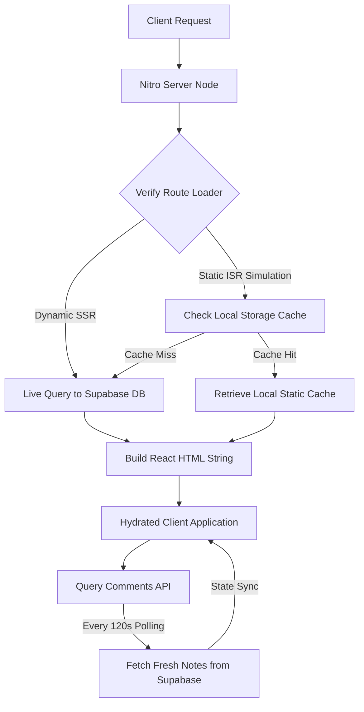

# Indie Coffee Hub — Technical Documentation

This document provides a comprehensive technical overview of **Indie Coffee Hub**, a web application and directory built for remote workers, digital nomads, and specialty coffee enthusiasts. All statements in this documentation are derived directly from the current codebase.

---

## 1. Project Overview and Purpose

**Indie Coffee Hub** is a curated global directory designed to help users locate independent specialty coffee shops suitable for remote work. The application focuses heavily on nomad-centric amenities such as high-speed WiFi, power outlet availability, air conditioning, and pet-friendliness.

### Key Capabilities:
*   **Specialty Cafe Catalog:** A searchable directory categorizing cafes by country, city, and neighborhood.
*   **Nomad Amenity Metrics:** Detailed reporting on WiFi speed, plug points, noise levels, and pet policies.
*   **Admin Command Center:** A secure, role-restricted dashboard allowing administrators to perform full CRUD operations on cafes, cities, and countries, optimize images, and monitor data processing pipelines.
*   **Hybrid Rendering Simulator:** A playground demonstrating the contrast between live, database-driven **Server-Side Rendering (SSR)** and cached **Incremental Static Regeneration (ISR)** with simulated edge CDN webhook invalidation.
*   **Community Reviews:** An interactive guest- and user-supported comment thread with automated background polling for real-time note syncing.
*   **The Brew Compass:** An educational micro-app containing interactive guides, recipe decoder calculators, roast spectrum analysis, and origin mapping.

---

## 2. Technology Stack

The project relies on a modern React-centric frontend framework, a serverless backend provider, and automated image management services:

| Layer | Technology / Library | Version | Purpose |
| :--- | :--- | :--- | :--- |
| **Core Framework** | React | `^19.2.0` | Frontend UI rendering, custom hook abstractions, and state management. |
| **Meta-Framework** | TanStack React Start | `^1.167.50` | Server-Side Rendering (SSR), hydration, and server-side request middleware. |
| **Routing** | TanStack React Router | `^1.168.25` | Type-safe client-side routing, query parameter validation, and preloading. |
| **Data Fetching** | TanStack React Query | `^5.83.0` | Asynchronous database state synchronization, caching, and mutation tracking. |
| **Database & Auth** | Supabase JS SDK | `^2.108.2` | PostgreSQL database, real-time queries, authentication sessions, and profiles. |
| **Styling** | Tailwind CSS | `^4.2.1` | Modern utility-first CSS framework with native build-time compiler support. |
| **Image Hosting** | Cloudinary API | *N/A* | Image storage, dynamic compression, and automated format transcoding (WebP). |
| **Bundler & Server** | Vite & Nitro | `^8.0.16` / `^3.0.260603` | Fast build tool and lightweight server engine executing SSR and API endpoints. |
| **UI Components** | Radix UI / Lucide React | *Various* | Unstyled accessible primitives (Sonner, Accordion, etc.) and iconography. |
| **Validation** | Zod / React Hook Form | `^3.24.2` / `^7.71.2` | Schema validations for search params and admin registry forms. |

---

## 3. Folder and File Structure

Below is the directory structure highlighting key files and their purposes:

```text
indie_cafe_hub/
├── .env                                  # Local environment variables
├── package.json                          # Project dependencies and script runner configurations
├── vite.config.ts                        # Vite compilation configuration using TanStack Start & Nitro plugins
├── netlify.toml                          # Netlify build and deployment commands
├── database/                             # Supabase / PostgreSQL database scripts
│   ├── 1_table_creation.sql              # Core table schemas (profiles, countries, cities, cafes, comments)
│   ├── 2_index_optimization.sql          # SQL indexing optimizations for filters
│   ├── 3_triggers_and_functions.sql      # Database triggers for user profile generation
│   ├── 4_RLS_and_policies.sql            # Row Level Security configuration and public.is_admin checks
│   ├── 5_seed_initial_data.sql          # Seed data script for cities, countries, and cafes
│   └── database_schema.md                # Markdown documentation for DB configurations
├── src/                                  # Application source directory
│   ├── components/                       # Shared React components and UI primitives
│   │   ├── ui/                           # Shading components (buttons, input, dialogs, cards, charts)
│   │   ├── accessibility-context.tsx     # Context provider managing color-blindness modes
│   │   ├── site-chrome.tsx               # Common global Header, Footer, and Profile Modal
│   │   ├── cafe-card.tsx                 # Reusable cafe card component showing amenity badges
│   │   └── comments-section.tsx          # Comment layout with background synchronization
│   ├── hooks/                            # Custom React hooks
│   │   └── use-mobile.tsx                # Responsive breakpoint listener for mobile devices
│   ├── lib/                              # Core utilities and state contexts
│   │   ├── auth-context.tsx              # Supabase Auth session wrapper and profile sync state
│   │   ├── cache.ts                      # Local rendering strategy cache simulator utility
│   │   ├── cafes.ts                      # Core database querying and UI object mapping logic
│   │   ├── error-capture.ts              # Global listener capturing SSR thread exceptions
│   │   ├── error-page.ts                 # Fallback HTML layout for catastrophic errors
│   │   ├── supabase.ts                   # Supabase client instantiation
│   │   └── utils.ts                      # Tailwind styling merge utilities
│   ├── routes/                           # File-based routing tree (TanStack React Router)
│   │   ├── __root.tsx                    # Global layout wrapper providing contexts
│   │   ├── index.tsx                     # Landing home page
│   │   ├── directory.tsx                 # Main search, location filtering catalog
│   │   ├── admin.tsx                     # Protected registry portal with upload pipelines
│   │   ├── login.tsx                     # Authentication login page
│   │   ├── signup.tsx                    # User sign up form page
│   │   ├── about.tsx                     # Static Info Page
│   │   ├── contact.tsx                   # Static Contact Page
│   │   ├── brew-compass/                 # Educational micro-app route nested tree
│   │   │   ├── index.tsx                 # Brew School Hub dashboard
│   │   │   ├── menu-decoder.tsx          # Espresso anatomy layer animation
│   │   │   ├── chilled-bar.tsx           # Cold coffee guide
│   │   │   ├── black-coffee.tsx          # Black coffee techniques
│   │   │   ├── global-specialties.tsx    # Specialty coffee cultures
│   │   │   ├── connoisseur.tsx           # Rare bean roasts
│   │   │   ├── bean-roast-spectrum.tsx   # Roast temperature intervals
│   │   │   ├── coffee-atlas.tsx          # Geographical map
│   │   │   └── milk-types.tsx            # Dairy and alternative milk guidelines
│   │   ├── $country.$city.tsx            # City-specific filtered cafe list route
│   │   └── $country.$city.$cafeSlug.tsx  # Interactive individual cafe details layout
│   ├── routeTree.gen.ts                  # Automatically generated routing mapping tree
│   ├── server.ts                         # Nitro SSR server entry middleware
│   ├── start.ts                          # Client hydration entry and error middlewares
│   └── styles.css                        # Main stylesheet styling tokens and color-blindness selectors
```

### Key UI Sub-Components Breakdown (`src/components/ui/`):
*   `accordion.tsx`, `collapsible.tsx`: UI containers for expanding FAQ sections and additional information.
*   `alert.tsx`, `alert-dialog.tsx`: Message modals for confirmation when deleting or modifying cafe items.
*   `avatar.tsx`: Renders visual initials for logged-in digital nomads and administrators.
*   `badge.tsx`: Displays amenity indicators such as "WiFi Friendly" and "Laptop Friendly".
*   `button.tsx`: Implements consistent click targets with micro-interactions.
*   `card.tsx`: Holds individual cafe elements and Brew Compass modules.
*   `carousel.tsx`: Manages interactive cafe gallery images utilizing `embla-carousel-react`.
*   `dialog.tsx`, `sheet.tsx`: Power overlay modals such as user profile settings and filter inputs.
*   `sonner.tsx`: Custom toast notifications (`Toaster`) that report validation or upload progress.
*   `switch.tsx`: Custom boolean toggles used in filter bars and strategy switches.

---

## 4. Application Architecture and Data Flow

Indie Coffee Hub uses a hybrid rendering architecture powered by **TanStack Start** and **Nitro** running on the server, and **React** managing hydration on the client. 

### Data Flow Diagram (Rendering Strategy):



### Rendering Strategies Detail:
1.  **Dynamic Server-Side Rendering (SSR):** When the strategy is set to `dynamic`, calls to `fetchCafes()` bypass any client caching, forcing an active network query directly to Supabase. This ensures that the most recent updates made by an administrator are instantly visible.
2.  **Incremental Static Regeneration (ISR) Simulation:** Because standard static CDNs are simulated, the application handles caching via local storage inside `src/lib/cache.ts`. In `isr` mode, `fetchCafes()` reads from the `indie_cafe_static_cache` key. When changes are saved in the admin panel, the admin code triggers a simulated webhook that invalidates the local storage cache and displays alerts showing how an edge CDN updates.

---

## 5. UI Structure, Pages, and Navigation

The UI incorporates responsive design principles using CSS Flexbox/Grid and custom fonts (`Outfit` for headings and `Work Sans` for body copy).

### Complete Route Mapping:

*   **Homepage (`src/routes/index.tsx`):**
    *   *Path:* `/`
    *   *Features:* Features a hero search input (`data-testid="hero-search-input"`), an onboarding CTA card to navigate to the Brew Compass (`data-testid="hero-brew-compass-cta"`), a rotating marquee banner, and a display of five hand-picked cafes.
    *   *Data Loading:* Uses `fetchCafes()` in a route loader to fetch the first five cafes.
*   **Directory Catalog (`src/routes/directory.tsx`):**
    *   *Path:* `/directory`
    *   *Features:* Houses search queries (`filter-search-input`) and dynamic selection dropdowns for countries and cities (`filter-country-select`, `filter-city-select`). Incorporates a WiFi amenity filter button (`filter-wifi-toggle`).
    *   *Rendering Info:* Includes an edge indicator showing whether the catalog was served from "Static CDN Edge (ISR Mode)" or via "Live DB Query (Dynamic SSR Mode)".
*   **Cafe Details Page (`src/routes/$country.$city.$cafeSlug.tsx`):**
    *   *Path:* `/$country/$city/$cafeSlug`
    *   *Features:* Generates the layout for a single cafe listing. Verifies geographical alignment with Route parameters. If parameters mismatch or a cafe is not found, displays a custom not found layout. Displays a zoomable cover image lightbox (`aria-label="Close Lightbox"`), a noise level emoji gauge, opening hours, plug point status, and the community reviews board.
*   **Admin Command Center (`src/routes/admin.tsx`):**
    *   *Path:* `/admin`
    *   *Features:* Role-restricted dashboard. Standard visitors are shown an admin locked state card (`data-testid="admin-locked-state"`). Authorized admins can access:
        1.  *Country Registry:* Text fields for country name and country ISO code.
        2.  *City Registry:* Text fields for city name, city slug, and country association.
        3.  *Cafe CRUD Grid:* An administrative table showing all cafes with edit icons (`data-testid="edit-cafe-btn"`) and delete triggers (`data-testid="delete-cafe-btn"`).
        4.  *Pipeline Tracker:* Visualizer displaying the current stage of data writes, from Cloudinary compression steps to database upserts.
*   **The Brew Compass (`src/routes/brew-compass/`):**
    *   *Dashboard Path:* `/brew-compass`
    *   *Sub-Modules:*
        1.  `menu-decoder`: Interactive espresso anatomy layer-pour animation.
        2.  `chilled-bar`: Guide to iced and cold-brewed specialties.
        3.  `black-coffee`: Brew parameters, temperature maps, and grind sizes for V60, Chemex, French Press, AeroPress, Moka Pot, and Kalita Wave.
        4.  `global-specialties`: Overview of regional coffee preparation methods.
        5.  `connoisseur`: Details on rare beans (Geisha, Cup of Excellence, Blue Mountain).
        6.  `bean-roast-spectrum`: Details on light, medium, and dark roast temperature intervals.
        7.  `coffee-atlas`: Geographic maps showing origin regions.
        8.  `milk-types`: Guide to dairy and plant-based milks.
*   **Sign In & Sign Up (`src/routes/login.tsx` & `src/routes/signup.tsx`):**
    *   *Paths:* `/login`, `/signup`
    *   *Features:* Split screen layouts featuring large ambient imagery, forms with email and password inputs, and validation error blocks.

---

## 6. Authentication and Session Handling

User authentication and accounts are managed through the **Supabase Auth** API, integrated via `src/lib/auth-context.tsx`.

### Core Flow:
*   **SignUp:** Collects a user's name, email, and password. Invokes `supabase.auth.signUp()`. The name is saved within the user metadata payload.
*   **SignIn:** Authenticates credentials with `supabase.auth.signInWithPassword()`. If successful, the user is navigated based on their credentials: administrators are directed to `/admin`, and standard users are redirected to the homepage.
*   **SignOut:** Invokes `supabase.auth.signOut()` and flushes the authentication context.
*   **Session Maintenance:** On initialization, the `AuthProvider` queries `supabase.auth.getSession()` to check for an active cookie or token. It registers a listener via `supabase.auth.onAuthStateChange()` to automatically synchronize changes when the user signs in or out.
*   **Profile Management:** A database trigger synchronizes authentication profiles. Standard users can update their display name through the profile dialog in the navigation header. This action updates both the Supabase metadata object and the `public.profiles` table.

---

## 7. Database Design (Supabase / PostgreSQL)

The database schema is written in raw SQL and utilizes native PostgreSQL triggers, constraints, index optimizations, and security policies.

### Database Tables Schema:

#### 1. Table `profiles`
Extends the core Supabase `auth.users` authentication details.
*   `id` (`uuid`, Primary Key): References `auth.users(id)` with a cascading delete constraint.
*   `full_name` (`text`): User's profile display name.
*   `avatar_url` (`text`): User's profile avatar media link.
*   `is_admin` (`boolean`): Set to `true` for administrators. Defaults to `false`.
*   `created_at` / `updated_at` (`timestamp with time zone`): Set to `now()` on creation.

#### 2. Table `countries`
*   `id` (`uuid`, Primary Key): Defaults to `gen_random_uuid()`.
*   `name` (`text`, Not Null, Unique): Country name (e.g. `India`).
*   `code` (`text`, Not Null, Unique): Country ISO code (e.g. `IN`).
*   `created_at` (`timestamp with time zone`): Defaults to `now()`.

#### 3. Table `cities`
*   `id` (`uuid`, Primary Key): Defaults to `gen_random_uuid()`.
*   `name` (`text`, Not Null): City name (e.g. `Bengaluru`).
*   `slug` (`text`, Not Null, Unique): URL-friendly string identifier (e.g. `bengaluru`).
*   `country_id` (`uuid`, Foreign Key): References `countries(id)` with a cascading delete constraint.
*   `created_at` (`timestamp with time zone`): Defaults to `now()`.
*   *Constraints:* Unique compound index on `(country_id, name)`.

#### 4. Table `cafes`
*   `id` (`uuid`, Primary Key): Defaults to `gen_random_uuid()`.
*   `name` (`text`, Not Null): Cafe name.
*   `slug` (`text`, Not Null, Unique): URL-friendly identifier.
*   `description` (`text`): Cafe biography.
*   `neighborhood` (`text`, Not Null): Neighborhood name.
*   `address` (`text`, Not Null): Physical street address.
*   `google_maps_url` (`text`): Link to location.
*   `has_wifi` (`boolean`): Defaults to `false`.
*   `has_plug_points` (`boolean`): Defaults to `false`.
*   `has_ac` (`boolean`): Defaults to `false`.
*   `is_pet_friendly` (`boolean`): Defaults to `false`.
*   `hero_image_url` (`text`, Not Null): Cover photo URL.
*   `gallery_image_urls` (`text[]`): Array of secondary photo links. Defaults to `{}`.
*   `opening_hours` (`jsonb`): JSON object containing days and time strings.
*   `specialty_focus` (`text`): Specialty roasts or filters.
*   `noise_level` (`text`): Noise level check constraint. Must be one of `('quiet', 'moderate', 'bustling')`.
*   `city_id` (`uuid`, Foreign Key): References `cities(id)` with a set null constraint.
*   `created_by` (`uuid`, Foreign Key): References `auth.users(id)` with a set null constraint.
*   `created_at` / `updated_at` (`timestamp with time zone`): Defaults to `now()`.

#### 5. Table `comments`
*   `id` (`uuid`, Primary Key): Defaults to `gen_random_uuid()`.
*   `cafe_id` (`uuid`, Foreign Key): References `cafes(id)` with a cascading delete constraint.
*   `author_id` (`uuid`, Foreign Key): References `auth.users(id)` with a set null constraint.
*   `author_name` (`text`, Not Null): Name displayed on the comment.
*   `content` (`text`, Not Null): Note message.
*   `is_guest` (`boolean`): Defaults to `true`.
*   `created_at` (`timestamp with time zone`): Defaults to `now()`.

### Index Optimizations:
To support high-performance filtering, the database implements the following indices:
*   `cafes_neighborhood_idx` on `public.cafes(neighborhood)` for neighborhood-based lookups.
*   `cafes_city_id_idx` on `public.cafes(city_id)` to speed up city-specific directory queries.
*   `cafes_has_wifi_idx` on `public.cafes(has_wifi)` where `has_wifi = true` (partial index optimization).
*   `cities_slug_idx` on `public.cities(slug)` for routing lookups.
*   `comments_cafe_id_idx` on `public.comments(cafe_id)` to optimize comment load times.

---

## 8. Row Level Security (RLS) & Policies

Every database table has Row Level Security active to enforce data isolation and restrict modifications to validated users.

### Admin Helper Function:
Administrative authorization is verified using a security definer database function `public.is_admin()`. This function executes in the database context and returns true if the request context's `auth.uid()` corresponds to a profile where `is_admin = true`.

### Table Access Rules:
*   **`profiles`**: Public read access (`SELECT`) is allowed for all users. Users can only modify (`UPDATE`) their own record, validated by `auth.uid() = id`.
*   **`countries` / `cities` / `cafes`**: Public read access is open to all visitors. All write operations (`INSERT`, `UPDATE`, `DELETE`) are restricted to administrators via `public.is_admin()`.
*   **`comments`**: Read access is public. Write access (`INSERT`) is open to any user (supporting guest reviews).

### Profile Trigger:
To ensure profiles exist for authenticated users, the database runs `handle_new_user()` on a trigger:
*   Trigger `on_auth_user_created` fires `AFTER INSERT` on `auth.users`.
*   It populates `public.profiles` using the user metadata.
*   **Note:** Admin status (`is_admin`) defaults to `false` for all newly registered profiles.

---

## 9. APIs, Backend Services, and Business Logic

The backend business logic is split between client utilities, server-side entry points, database functions, and external cloud services:

1.  **Supabase Client (`src/lib/supabase.ts`):** Initializes the client-side database agent using env credentials.
2.  **Cafe Services (`src/lib/cafes.ts`):** Exposes direct data querying functions:
    *   `fetchCountries()`, `fetchCities()`: Query geographical locations.
    *   `fetchCafes()`: Queries cafes, automatically serving from the client-side static local storage cache if the routing strategy is set to `isr`.
    *   `fetchCafeByIdOrSlug()`: Fetches a single cafe and retrieves its creator's profile display name.
3.  **Cloudinary Service:** The admin dashboard interacts with the Cloudinary REST API to upload images.
    *   The client requests a secure signature and timestamp from the Nitro backend server (`getCloudinarySignature` server function) using private server environment variables.
    *   The payload contains the file, public API key, timestamp, generated signature, and the upload preset.
    *   The uploaded image is compressed and optimized into a WebP format on Cloudinary's servers.
4.  **Local Strategy Cache Simulator (`src/lib/cache.ts`):** Simulates static generation caching in the browser. It writes fetched results to local storage and dispatches custom events (`delivery-strategy-change`, `isr-cache-updated`) to trigger reactive updates in the UI when strategies change.

---

## 10. Security Measures

*   **Database Level Rules:** RLS policies prevent unauthorized write operations, block metadata tampering, and restrict administrator tools to authorized users.
*   **Admin Route Guarding:** In `src/routes/admin.tsx`, the UI verifies `user.isAdmin` before rendering forms. Unauthorized users are blocked by a secure locked state card.
*   **Data Validation:** Zod schemas validate directory search query payloads, and input controls sanitize text areas.
*   **Secret Management:** Sensitive endpoints, API keys, and connection credentials are loaded from environment variables (`.env`). The build configuration excludes these keys from build logs and scanning processes.

---

## 11. State Management

*   **Asynchronous Database State:** Handled by **TanStack React Query** on the client, managing request loading indicators, cache invalidations, and data synchronization.
*   **Authentication State:** Managed by `AuthContext` in `src/lib/auth-context.tsx`. This provider shares the current user profile, role status, and session handlers across all routes.
*   **Accessibility Theme State:** Managed by `AccessibilityContext` in `src/components/accessibility-context.tsx`. This context manages color-blindness preferences (protanopia, deuteranopia, tritanopia, monochromacy), applying theme attributes to the HTML element.
*   **Local UI State:** React's `useState` hooks manage local states, such as form inputs, dropdown selections, upload progress, and image zoom modals.

---

## 12. Error Handling and Logging

The server employs a robust system to catch and log errors, preventing applications from crashing and exposing raw errors to users.

1.  **Global Listener (`src/lib/error-capture.ts`):** Listens for `error` and `unhandledrejection` events. It records exceptions in a temporary global variable `lastCapturedError` for a short period (TTL: 5 seconds).
2.  **Nitro Server Interceptor (`src/server.ts`):** Intercepts server-side rendering errors. The server engine (`h3`) normally catches server-side throws and returns a generic 500 JSON response. The server middleware reads the response status, fetches the original error from `lastCapturedError` if available, logs the stack trace to the console, and returns a clean, user-friendly HTML error page.
3.  **Client Error Bound UI (`src/routes/__root.tsx`):** Provides a visual fallback layout with a retry button for client-side routing exceptions, allowing users to reload the page or navigate home without a full browser crash.

### Catastrophic Server Error Normalization Flow:
```text
[HTTP Throw in Loader/Action]
             │
             ▼
[globalThis "error" Listener (src/lib/error-capture.ts)]
             │  (Cache stack/message out-of-band in lastCapturedError)
             ▼
[h3 Server Engine swallows throw -> Returns 500 JSON response]
             │  ("unhandled": true, "message": "HTTPError")
             ▼
[normalizeCatastrophicSsrResponse Middleware (src/server.ts)]
             │  (Reads 500 status & retrieves cached error stack)
             ▼
[Return renderErrorPage() fallback HTML -> Client displays Try Again UI]
```

---

## 13. Performance Optimizations

*   **Cloudinary URL Transforming:** In `src/lib/cafes.ts`, the helper function `optimizeCloudinaryUrl` checks image links. If an image is hosted on Cloudinary, it appends formatting parameters (`f_auto` to serve WebP/AVIF formats, `q_auto` for quality compression, and `w_[width]` to scale the image based on the screen layout).
*   **Partial Indexes:** Database queries are optimized using selective indexing, filtering out unnecessary rows (such as only indexing cafes where `has_wifi = true` for fast WiFi filtering).
*   **Preloading Routes:** TanStack Router preloads route definitions and API dependencies on hover, speeding up page navigation.

---

## 14. Accessibility Color-Blindness Theme System

Theme controls dynamically alter structural custom CSS parameters according to the selected configuration. These modes map directly to custom selectors in `src/styles.css`:

```css
/* Default Theme Variables */
:root {
  --cafe-bg: #fff7f5;
  --cafe-primary: #e67e6b;
  --cafe-primary-hover: #d96c5a;
  --cafe-primary-light: #fde4dd;
  --cafe-open-bg: #e8f5e9;
  --cafe-open-text: #2e7d32;
}

/* Protanopia (Red-Green Color Blindness) */
[data-accessibility="protanopia"] {
  --cafe-bg: #f0fdf4;
  --cafe-primary: #059669;
  --cafe-primary-hover: #047857;
  --cafe-primary-light: #d1fae5;
  --cafe-open-bg: #d1fae5;
  --cafe-open-text: #065f46;
}

/* Deuteranopia (Green-Weakness Color Blindness) */
[data-accessibility="deuteranopia"] {
  --cafe-bg: #eff6ff;
  --cafe-primary: #2563eb;
  --cafe-primary-hover: #1d4ed8;
  --cafe-primary-light: #dbeafe;
}

/* Tritanopia (Blue-Yellow Color Blindness) */
[data-accessibility="tritanopia"] {
  --cafe-bg: #fdf2f8;
  --cafe-primary: #db2777;
  --cafe-primary-hover: #be185d;
}

/* Monochromacy (Full Color Blindness) */
[data-accessibility="monochromacy"] {
  --cafe-bg: #f9fafb;
  --cafe-primary: #1f2937;
  --cafe-primary-hover: #111827;
}
```

---

## 15. Configuration, Build, and Deployments

### Environment Variables Required (`.env`):
*   `VITE_SUPABASE_URL`: API endpoint for the Supabase project instance.
*   `VITE_SUPABASE_ANON_KEY`: Client-side safe anonymous token for database calls.
*   `VITE_CLOUDINARY_CLOUD_NAME`: Target account identifier for uploads.
*   `VITE_CLOUDINARY_UPLOAD_PRESET`: Preset specifying image transformations and folder destinations.
*   `CLOUDINARY_API_KEY`: Cloudinary API Key for signed uploads (kept secure on server).
*   `CLOUDINARY_API_SECRET`: Cloudinary API Secret used for signing parameters on server (never exposed to client).

### Package Scripts:
*   `npm run dev`: Boots the local Vite dev server.
*   `npm run build`: Compiles production-ready client bundles and server assets.
*   `npm run format`: Standardizes code style across the codebase using Prettier.
*   `npm run lint`: Analyzes source files using ESLint rules.

### Hosting Configurations:
The application can be deployed to platforms like **Netlify** or **Vercel**. 
*   **Netlify Integration:** Configured in `netlify.toml`, executing `npm run build` and outputting assets to the `dist` directory.
*   **Vercel Integration:** Handled by the Nitro engine, generating routing configurations and edge function files inside `.vercel/output`.

---

## 16. Testing Strategy

The current codebase does not include an automated testing framework (such as Vitest, Jest, or Playwright).

### Verification Protocol:
Quality assurance is validated through manual testing and user-centric browser verification:
*   Checking responsive layouts across mobile, tablet, and desktop breakpoints.
*   Verifying data updates in dynamic and cached rendering modes.
*   Checking RLS policies by trying to execute unauthorized database writes from the client.
*   Verifying color-blindness themes visually using the accessibility toggles in the header.

---

## 17. Limitations and Technical Debt

1.  **Edge CDN Invalidation:** The ISR simulation runs inside the server's in-memory storage rather than serverless edge handlers. For true production ISR, these invalidation endpoints should compile into Netlify or Vercel edge caching functions.
2.  **No Automated Test Coverage:** The lack of unit, integration, or end-to-end tests makes the codebase vulnerable to regressions during updates.
3.  **Admin Assignment:** There is no self-service or automatic administrative role assignment. The role must be manually assigned via direct database query or the Supabase console.
