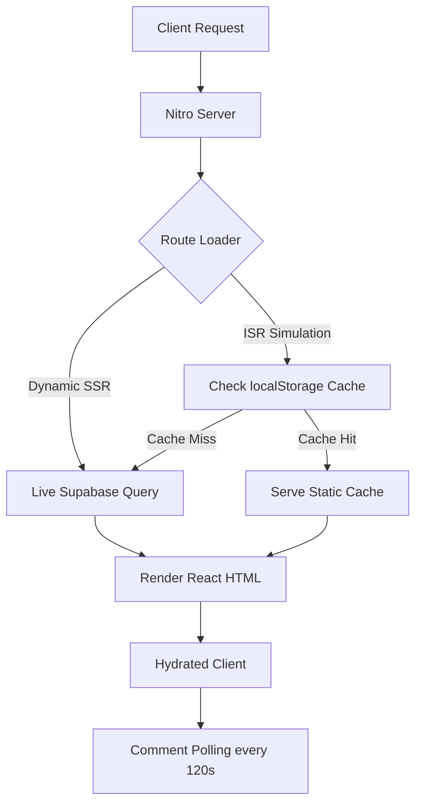

# Indie Coffee Hub — Technical Documentation

A comprehensive reference for the **Indie Coffee Hub** codebase — a global directory of independent specialty cafes built for remote workers and coffee enthusiasts.

---

## 1. Project Overview

**Indie Coffee Hub** is a curated directory helping users discover independent specialty coffee shops suited for remote work. Key capabilities:

- **Specialty Cafe Catalog:** Searchable directory filtered by country, city, and neighborhood.
- **Nomad Amenity Metrics:** WiFi, plug points, noise levels, AC, and pet-friendliness per cafe.
- **Admin Command Center:** Role-restricted dashboard for full CRUD on cafes, cities, and countries with image upload pipelines.
- **Hybrid Rendering Simulator:** Demonstrates SSR vs. ISR with simulated edge CDN webhook invalidation.
- **Community Reviews:** Comment threads with background polling for real-time note syncing.
- **The Brew Compass:** Educational micro-app with drink guides, recipe calculators, roast spectrum, and origin mapping.

---

## 2. Technology Stack

| Layer | Technology | Version | Purpose |
| :--- | :--- | :--- | :--- |
| **Core Framework** | React | `^19.2.0` | UI rendering, hooks, and state management |
| **Meta-Framework** | TanStack React Start | `^1.167.50` | SSR, hydration, and server middleware |
| **Routing** | TanStack React Router | `^1.168.25` | Type-safe file-based routing with loader preloading |
| **Data Fetching** | TanStack React Query | `^5.83.0` | Async state, caching, and mutation tracking |
| **Database & Auth** | Supabase JS SDK | `^2.108.2` | PostgreSQL, auth sessions, and profiles |
| **Styling** | Tailwind CSS | `^4.2.1` | Utility-first CSS with native build-time compiler |
| **Image Hosting** | Cloudinary API | — | Storage, WebP transcoding, and dynamic compression |
| **Bundler & Server** | Vite & Nitro | `^8.0.16` / `^3.x` | Build tool and SSR/API server engine |
| **UI Components** | Radix UI / Lucide React | Various | Accessible primitives and iconography |
| **Validation** | Zod / React Hook Form | `^3.24.2` / `^7.71.2` | Search param schemas and admin form validation |

---

## 3. Folder Structure

```text
indie_cafe_hub/
├── .env                                  # Environment variables
├── package.json                          # Dependencies and scripts
├── vite.config.ts                        # Vite + TanStack Start + Nitro config
├── netlify.toml                          # Netlify build config
├── documentation/
│   └── technical_documentation.md       # This file
├── database/
│   ├── 1_table_creation.sql             # Core table schemas
│   ├── 2_index_optimization.sql         # SQL index optimizations
│   ├── 3_triggers_and_functions.sql     # Profile auto-creation trigger
│   ├── 4_RLS_and_policies.sql           # Row Level Security policies
│   ├── 5_seed_initial_data.sql          # Seed data for cities/countries/cafes
│   └── database_schema.md               # DB schema reference
└── src/
    ├── components/
    │   ├── ui/                           # Radix-based primitives (button, dialog, carousel, etc.)
    │   ├── accessibility-context.tsx     # Color-blindness theme context provider
    │   ├── cafe-card.tsx                 # Reusable cafe card (uniform image, city/country display)
    │   ├── comments-section.tsx          # Comment thread with background polling
    │   └── site-chrome.tsx              # Global Header, Footer, and Profile Modal
    ├── hooks/
    │   └── use-mobile.tsx               # Responsive breakpoint listener
    ├── lib/
    │   ├── auth-context.tsx             # Supabase Auth session wrapper and profile sync
    │   ├── cache.ts                     # ISR simulation cache utility (localStorage)
    │   ├── cafes.ts                     # DB queries, Cafe type, and UI mapping logic
    │   ├── error-capture.ts             # Global SSR exception listener
    │   ├── error-page.ts               # Fallback HTML for catastrophic errors
    │   ├── supabase.ts                  # Supabase client instantiation
    │   └── utils.ts                     # Tailwind merge utilities
    └── routes/
        ├── __root.tsx                   # Global layout, context providers
        ├── index.tsx                    # Homepage — featured cafes grid + hero search
        ├── directory.tsx               # Search and filter catalog
        ├── admin.tsx                   # Protected admin dashboard
        ├── login.tsx                   # Sign-in form
        ├── signup.tsx                  # Sign-up form
        ├── forgot-password.tsx         # Password reset request
        ├── reset-password.tsx          # Password reset confirmation
        ├── about.tsx                   # Static info page
        ├── contact.tsx                 # Static contact page
        ├── brew-compass/               # Educational micro-app (nested routes)
        ├── $country.$city.tsx          # City-filtered cafe list
        └── $country.$city.$cafeSlug.tsx  # Individual cafe detail page
```

---

## 4. Architecture and Data Flow

TanStack Start + Nitro handle SSR on the server; React manages hydration on the client.



**Rendering Modes:**
- **Dynamic SSR:** `fetchCafes()` bypasses cache — always queries Supabase live. Admin changes are instantly visible.
- **ISR Simulation:** Reads from `indie_cafe_static_cache` in localStorage. Admin saves trigger a simulated webhook that clears and refills the cache, mimicking edge CDN invalidation.

---

## 5. Pages and Routes

### Homepage (`/`) — `src/routes/index.tsx`
- Loader calls `fetchCafes()` and slices the first 5 results as `featured`.
- **Featured grid:** `grid-cols-1 md:grid-cols-2 gap-6 auto-rows-stretch`. Each `CafeCard` is `flex flex-col h-full`, ensuring all cards in a row share identical height with DETAILS bars aligned at the same baseline.
- **Odd-count guard:** If `featured.length % 2 !== 0`, a "/// DISCOVER MORE SPACES ///" CTA block fills the empty grid slot, linking to `/directory`.
- Sections: Featured Cafes → Hero Search → Brew Compass CTA → Monospace ticker marquee.

### Directory (`/directory`) — `src/routes/directory.tsx`
- Loader fetches `cafes` and `cities` in parallel via `Promise.all`.
- Client-side filters: text search (`filter-search-input`), country select (`filter-country-select`), city select (`filter-city-select`), WiFi-only toggle (`filter-wifi-toggle`).
- Rendering strategy badge shows "Static CDN Edge (ISR)" or "Live DB Query (Dynamic SSR)".

### Cafe Detail (`/$country/$city/$cafeSlug`) — `src/routes/$country.$city.$cafeSlug.tsx`
- Validates URL params against DB data; renders a custom 404 on mismatch.
- Features: zoomable hero image lightbox, noise-level emoji gauge, per-day opening hours, plug point status, community reviews board.

### Admin (`/admin`) — `src/routes/admin.tsx`
- Role-gated: renders locked state card for non-admins (`data-testid="admin-locked-state"`).
- **Cafe CRUD:** Create, edit, delete cafes with image upload pipeline (Cloudinary → Supabase).
- **`created_by` capture:** On **create**, `supabase.auth.getUser()` is called at insert time and the admin's UUID is written to `cafes.created_by`. Not overwritten on update.
- **Country & City Registries:** Separate forms for managing geographical data.
- **Pipeline Tracker:** Visualizes write stages — Serialize → Media CDN → Supabase Write → Webhook.

### Sign Up (`/signup`) — `src/routes/signup.tsx`
- On successful `supabase.auth.signUp()`, displays **"Sign Up Successful!"** with "Your account has been created. You can now sign in."
- No email verification copy shown. A **"Go to Login"** button links to `/login`.

### Sign In (`/login`) — `src/routes/login.tsx`
- Authenticates via `supabase.auth.signInWithPassword()`. Admins redirect to `/admin`; standard users to `/`.

### Brew Compass (`/brew-compass`) — `src/routes/brew-compass/`
Sub-modules: `menu-decoder`, `chilled-bar`, `black-coffee`, `global-specialties`, `connoisseur`, `bean-roast-spectrum`, `coffee-atlas`, `milk-types`.

---

## 6. `CafeCard` Component — `src/components/cafe-card.tsx`

The primary display unit across the homepage, directory, and city pages.

| Feature | Implementation |
| :--- | :--- |
| **Image** | Fixed `h-48 object-cover object-center` on `` — identical crop on every card |
| **Card wrapper** | `flex flex-col h-full` — pairs with `auto-rows-stretch` grid so row heights are uniform |
| **Body** | `flex flex-col flex-1 justify-between p-4` — pushes DETAILS bar to the absolute bottom |
| **Description** | `line-clamp-3` — truncates with `…` to cap text height variance |
| **Location row** | `MapPin` (neighborhood) + `Clock` (hours) + `Globe` (city, country) — Globe row only renders if `city_name` or `country_name` is present |
| **Props** | `cafe: Cafe`, `className?: string`, `to?: string` — `imageHeightClass` prop removed |

---

## 7. `Cafe` Type and Data Layer — `src/lib/cafes.ts`

### `Cafe` Type (key fields)
```ts
type Cafe = {
  id: string;              // slug or UUID
  dbId: string;            // raw DB UUID
  name: string;
  neighborhood: string;
  blurb: string;           // mapped from DB `description`
  image: string;           // Cloudinary-optimized hero URL
  gallery: string[];
  tags: string[];          // derived from amenity booleans + specialty_focus
  wifi: boolean;
  hours: string;           // derived from opening_hours.monday or "9am – 9pm" fallback
  city_name?: string;      // resolved from cities join
  country_name?: string;   // resolved from cities.countries join
  created_by_name?: string;// resolved from profiles join (detail page only)
  city_id?: string;
  noise_level?: "quiet" | "moderate" | "bustling";
  opening_hours?: { monday?: string; ... sunday?: string };
  google_maps_url?: string;
};
```

### Key Functions
| Function | Supabase Query | Notes |
| :--- | :--- | :--- |
| `fetchCafes()` | `select("*, cities(name, countries(name))")` | Joins city + country names; serves ISR localStorage cache if strategy = `isr` |
| `fetchCafesByCity(cityId)` | `select("*").eq("city_id", cityId)` | City detail pages |
| `fetchCafeByIdOrSlug(id)` | `select("*")` + separate profiles query | Resolves `created_by_name`; always bypasses ISR cache |
| `fetchCities()` | `select("*, countries(*)")` | Falls back to hardcoded list on DB error |
| `fetchCountries()` | `select("*")` | Ordered by name |
| `optimizeCloudinaryUrl()` | — | Appends `f_auto,q_auto,w_N` to Cloudinary URLs |

---

## 8. Authentication — `src/lib/auth-context.tsx`

| Action | Implementation |
| :--- | :--- |
| **Sign Up** | `supabase.auth.signUp()` with `full_name` in metadata. UI shows success screen — no verification email message. |
| **Sign In** | `supabase.auth.signInWithPassword()`. `isAdmin` flag read from `profiles.is_admin`. |
| **Sign Out** | `supabase.auth.signOut()` + context flush |
| **Session init** | `getSession()` on mount + `onAuthStateChange()` listener |
| **Profile update** | Updates `auth.updateUser` metadata and `profiles.full_name` in DB |

`AuthUser` context shape: `{ email, name, isAdmin }`. Raw UUID is **not** stored in context — features requiring it call `supabase.auth.getUser()` directly (e.g., `created_by` on cafe insert in `admin.tsx`).

---

## 9. Database Schema — Supabase / PostgreSQL

### `profiles`
`id` (uuid, PK → auth.users) | `full_name` | `avatar_url` | `is_admin` (bool, default false) | `created_at` / `updated_at`

### `countries`
`id` (uuid, PK) | `name` (unique) | `code` (ISO, unique) | `created_at`

### `cities`
`id` (uuid, PK) | `name` | `slug` (unique) | `country_id` (FK → countries, cascade delete) | `created_at`  
Unique compound: `(country_id, name)`

### `cafes`
`id` (uuid, PK) | `name` | `slug` (unique) | `description` | `neighborhood` | `address` | `google_maps_url` | `has_wifi` | `has_plug_points` | `has_ac` | `is_pet_friendly` | `hero_image_url` | `gallery_image_urls` (text[]) | `opening_hours` (jsonb) | `specialty_focus` | `noise_level` (check: quiet/moderate/bustling) | `city_id` (FK → cities, set null) | **`created_by`** (FK → auth.users, set null) | `created_at` / `updated_at`

> `created_by` is written on **insert only** using the admin's live UUID from `supabase.auth.getUser()`. It is not modified on subsequent updates.

### `comments`
`id` (uuid, PK) | `cafe_id` (FK → cafes, cascade delete) | `author_id` (FK → auth.users, set null) | `author_name` | `content` | `is_guest` (bool) | `created_at`

### Indexes
- `cafes_neighborhood_idx` on `cafes(neighborhood)`
- `cafes_city_id_idx` on `cafes(city_id)`
- `cafes_has_wifi_idx` on `cafes(has_wifi)` where `has_wifi = true` (partial)
- `cities_slug_idx` on `cities(slug)`
- `comments_cafe_id_idx` on `comments(cafe_id)`

---

## 10. Row Level Security

All tables have RLS enabled. `public.is_admin()` is a security-definer function that reads `profiles.is_admin` for the current `auth.uid()`.

| Table | Read | Write |
| :--- | :--- | :--- |
| `profiles` | Public | Own record only (`auth.uid() = id`) |
| `countries` / `cities` / `cafes` | Public | Admins only via `is_admin()` |
| `comments` | Public | Any user (guest comments supported) |

**Profile trigger:** `on_auth_user_created` fires `AFTER INSERT ON auth.users` → auto-populates `public.profiles`. `is_admin` defaults to `false`.

---

## 11. Security

- **RLS:** Prevents unauthorized DB writes at the database layer.
- **Admin route guarding:** `admin.tsx` checks `user.isAdmin` before rendering any form or CRUD control.
- **Signed Cloudinary uploads:** Signature generated server-side via Nitro `createServerFn` using `CLOUDINARY_API_SECRET`; client only receives the signed payload — secret never reaches the browser.
- **Secret management:** Sensitive keys loaded from `.env`; Vite `VITE_` prefix exposes only safe client vars.

---

## 12. Error Handling

1. **`src/lib/error-capture.ts`:** Listens for `error` / `unhandledrejection` events; caches stack in `lastCapturedError` (TTL: 5s).
2. **`src/server.ts`:** Nitro middleware intercepts 500 responses, retrieves the cached error, and returns a clean HTML fallback page via `renderErrorPage()`.
3. **`src/routes/__root.tsx`:** Client-side error boundary with a retry button for routing exceptions.

---

## 13. Performance

- **Cloudinary URL optimization:** `optimizeCloudinaryUrl()` injects `f_auto,q_auto,w_N` — auto WebP/AVIF and responsive width scaling.
- **Partial DB indexes:** WiFi-only partial index for fast amenity filtering.
- **Route preloading:** TanStack Router preloads data dependencies on hover.
- **Lazy image loading:** All `CafeCard` images use `loading="lazy"`.
- **Uniform grid layout:** `auto-rows-stretch` + `h-full` cards eliminate layout reflow from uneven content heights.

---

## 14. Accessibility — Color-Blindness Themes

`AccessibilityContext` writes a `data-accessibility` attribute to `<html>`. CSS variables in `src/styles.css` override for each mode:

| Mode | Attribute value | Primary color |
| :--- | :--- | :--- |
| Default | *(none)* | `#e67e6b` |
| Protanopia | `protanopia` | `#059669` |
| Deuteranopia | `deuteranopia` | `#2563eb` |
| Tritanopia | `tritanopia` | `#db2777` |
| Monochromacy | `monochromacy` | `#1f2937` |

---

## 15. Configuration and Deployment

### Environment Variables
| Variable | Purpose |
| :--- | :--- |
| `VITE_SUPABASE_URL` | Supabase project API endpoint |
| `VITE_SUPABASE_ANON_KEY` | Client-safe anon token |
| `VITE_CLOUDINARY_CLOUD_NAME` | Cloudinary account identifier |
| `VITE_CLOUDINARY_UPLOAD_PRESET` | Upload preset for transformations |
| `CLOUDINARY_API_KEY` | Server-side signed upload key |
| `CLOUDINARY_API_SECRET` | Server-side signing secret (never exposed to client) |

### Scripts
| Command | Action |
| :--- | :--- |
| `npm run dev` | Start local Vite dev server |
| `npm run build` | Compile production bundles |
| `npm run format` | Run Prettier |
| `npm run lint` | Run ESLint |

### Hosting
- **Netlify:** `netlify.toml` runs `npm run build`, outputs to `dist/`.
- **Vercel:** Nitro generates routing configs and edge function files in `.vercel/output`.

---

## 16. Known Limitations

1. **ISR simulation is browser-local:** Cache runs in `localStorage`, not real edge CDN handlers. Production ISR would require Netlify/Vercel edge functions.
2. **No automated test coverage:** No unit, integration, or E2E tests — regression risk on updates.
3. **Manual admin assignment:** `is_admin` must be set directly in Supabase; no self-service role elevation.
